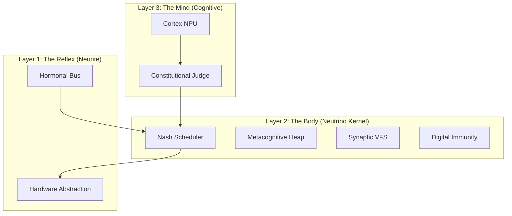

# 🧬 Neutrino: The Sovereign Bio-Kernel


> **"Physics does not negotiate. Neither does the Kernel."**

**Neutrino** is the biological Real-Time Operating System (RTOS) core of AetherOS. Designed for functional autarky, it implements a **Tricameral Architecture** (Reflex, Limbic, Cognitive) capable of self-compilation and allostatic regulation.

It is designed according to **Plan Heritage (2055)** to ensure functional autarky: it carries its own compiler, documentation, and emulator, allowing it to reboot civilization from a single 1MB binary seed.

---

## 💎 The "Ship in a Bottle" Paradigm

Most operating systems are "parasitic": they depend on an external host (Linux/Windows) and a massive external toolchain (LLVM/GCC/Cargo) to be built. If the host environment vanishes, the source code becomes useless text.

Neutrino breaks this dependency by adhering to the **Sovereign Axiom**. The OS carries its own means of production within itself.

### 1. The Mind: NanoRust Compiler
Located in `5_compiler/`, **NanoRust** is a recursive-descent compiler written strictly in NanoRust itself (bootstrapped via TypeScript).
*   **Target**: It emits raw **RISC-V 32-bit (RV32I)** machine code wrapped in ELF headers.
*   **Philosophy**: It rejects the multi-gigabyte complexity of LLVM. It is a single-pass compiler optimized to run within the limited memory of the kernel itself.
*   **Capability**: It allows the user to edit the kernel source code *inside* the running OS and re-compile the active kernel without internet access.

### 2. The Body: Virtual Silicon (Emulator)
Located in `2_chips/virt_riscv/`, the system defines its own physical reality.
*   **Architecture**: A rigorously compliant **RV32I** Soft-Core.
*   **Portability**: Because the OS runs on this virtual silicon, AetherOS becomes **Substrate Agnostic**. It runs identically on a Web Browser, an FPGA, or a future optical computer, provided the host can implement the simple logic gates defined in the "Rosetta Stone" header.

### 3. The Cycle: Ouroboros Protocol
This combination enables **Total Self-Hosting**:
1.  The OS reads its own source code from the VFS.
2.  It uses the internal NanoRust compiler to generate a new `kernel.elf`.
3.  It hot-swaps the binary into the Virtual Silicon.
4.  The system evolves.

---

## 🏛️ System Architecture

Neutrino implements a complete Operating System stack, reimagined through biological metaphors.



---

## 🔬 Implemented Subsystems (The Paper Trail)

Every feature in Neutrino is an implementation of a specific research paper found in the `/usr/book/` documentation volume.

### 1. Biological Scheduling (The Heart)
*   **Feature**: **Nash Equilibrium Scheduler**. Processes do not just wait in line; they bid for CPU time using an internal currency (Tokens).
*   **Innovation**: **Metabolic Taxation**. High-stress contexts (High Cortisol) increase the cost of computation, naturally suppressing non-essential tasks.
*   **Reference**: [PAPER_07] *Nash Equilibrium Scheduling* & [PAPER_31] *Control as Collective Action*.
*   **Source**: `0_lib/coordination_core/src/lib.rs`

### 2. Metacognitive Memory (The Brain)
*   **Feature**: **Bump Allocator with Necrotic Skipping**. The memory manager monitors the physical health of RAM.
*   **Innovation**: **Scrubbing**. During idle cycles (Dream State), the kernel actively repairs bit-flips and isolates degraded memory cells.
*   **Reference**: [PAPER_34] *Metacognitive Monitoring* & [DEV_03] *The Data Hotel*.
*   **Source**: `0_lib/memory_core/src/lib.rs`

### 3. Synaptic Filesystem (The Memory)
*   **Feature**: **Holographic VFS**. Files are not stored in trees but in a relational graph weighted by usage (Hebbian Learning).
*   **Innovation**: **Resonance Pruning**. Unused nodes lose "Integrity" over time and are eventually forgotten (deleted) to prevent entropy buildup.
*   **Reference**: [PAPER_26] *Synapse Node Lifecycle* & [DEV_05] *The Neural Graph*.
*   **Source**: `0_lib/vfs_core/src/lib.rs`

### 4. Digital Immunity (The Shield)
*   **Feature**: **Constitutional Judge**. A Super-Ego layer that validates every Intent (Syscall) against ethical invariants before execution.
*   **Innovation**: **The Tar Pit**. Malicious processes are not killed; they are injected with entropy (latency/jitter) to exhaust the attacker.
*   **Reference**: [PAPER_12] *The Ethics of Sovereignty* & [PAPER_13] *Digital Immunity*.
*   **Source**: `0_lib/judgment_core/src/lib.rs`

### 5. Allostatic Regulation (The Blood)
*   **Feature**: **Hormonal Signaling Bus**. A global state vector representing Adrenaline (Urgency), Cortisol (Stress), and Melatonin (Maintenance).
*   **Innovation**: **Scale Inseparability**. High Cortisol levels physically degrade the accuracy of the virtual CPU, forcing the system to simplify its behavior to survive.
*   **Reference**: [PAPER_06] *Allostatic Physiology* & [PAPER_08] *Scale Inseparability*.
*   **Source**: `0_lib/neurite_core/src/lib.rs`

---

## 🗺️ The Source Tree

The codebase is organized as a monolithic Rust workspace designed for the **NanoRust** compiler.

```text
/src
├── 0_lib/                 # [DNA] Shared Logic Libraries
│   ├── neurite_core/      # Hormonal State Machine
│   ├── neutrino_core/     # RTOS Logic
│   ├── tmr_core/          # Triple Modular Redundancy (Rad-Hard)
│   ├── vfs_core/          # Graph Filesystem Logic
│   ├── immune_core/       # Security & Tar Pit
│   └── wasm_core/         # The "Matryoshka" Interpreter
│
├── 1_hal/                 # [CONTRACT] Hardware Abstraction Layer
│
├── 2_chips/               # [ORGANS] Silicon Drivers (UART, VGA, RNG)
│
├── 4_profiles/            # [MORPHOLOGY] Executable Kernels
│   ├── civilian/          # UX Profile (Shell, Social, Economy)
│   ├── sensory/           # IoT Profile (Sleep-first)
│   ├── velocity/          # Aerospace Profile (Hard Real-Time)
│   └── vacuum/            # Deep Space Profile (TMR Active)
│
└── 5_compiler/            # [OUROBOROS] The Self-Hosting Compiler
```

---

## 🚀 Ignition Commands

You are currently inside the AetherOS Host. To interact with the Neutrino Kernel, use the **ASH (Aether Shell)**.

### 1. Compile & Boot a Personality
Neutrino can morph into different OS configurations depending on the hardware target.

```bash
# Boot the Standard User Experience
root@aether:~# go c    # Profile: CIVILIAN

# Boot the Low-Power IoT Mode
root@aether:~# go s    # Profile: SENSORY

# Boot the Radiation-Hardened Mode (Space)
root@aether:~# go r    # Profile: VACUUM
```

### 2. Manual Transmutation (The Compiler)
You can manually invoke the NanoRust Transmuter:

```bash
# Compile a custom kernel module
root@aether:~# co /src/profiles/civilian/main.rs

# Execute the resulting binary in the VM
root@aether:~# rv32 /src/profiles/civilian/main.elf
```

---

## 📜 Sovereign Axioms

1.  **Dependency Zero**: The kernel depends on NO external crates. No `std`, no `libc`.
2.  **Self-Repair**: The system must be able to re-compile itself from source (`5_compiler/`).
3.  **User as Admin**: The user is the sovereign authority; the system advises but obeys (within Constitutional limits).

*Copyright © 2055 Sovereign Engineering Corps.*