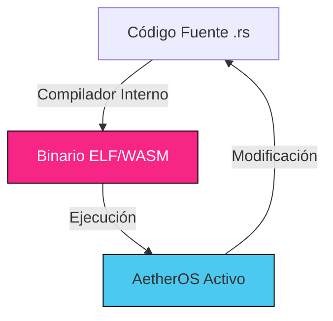

# 00. PREFACE: THE ARCHIVAL SEED
### MANIFIESTO DE SUPERVIVENCIA // DEV-SPEC-00

> "El software que depende de un servidor distante no es una herramienta; es una correa. El software que lleva su propio compilador es una semilla." — *Axioma Fundador de AetherOS*

AetherOS no es un producto; es un **Entorno Cognitivo de Circuito Cerrado**. Este manual asume que estás leyendo esto en una era donde la infraestructura centralizada ha colapsado o no es confiable. 

## 1. EL AXIOMA DE AUTARQUÍA
AetherOS está diseñado para ser **Autárquico** (Autosuficiente). Rechaza la dependencia de la "Nube". 
- Lleva su propio **Editor** para escribir lógica.
- Lleva su propio **Compilador** (NanoRust) para convertir esa lógica en materia.
- Lleva su propio **Substrato** (RISC-V/WASM) para ejecutar esa materia.

## 2. LAS TRES LEYES INVARIANTES
Cada línea de código que escribas en este sistema debe respetar estos tres principios:

| Ley | Nombre | Descripción | Mecanismo |
| :--- | :--- | :--- | :--- |
| **I** | **Soberanía** | Los datos pertenecen al silicio en el que nacen. | Cifrado AIP v3 |
| **II** | **Resonancia** | Las acciones deben alinearse con la intención humana. | Jueces Cognitivos |
| **III** | **Resiliencia** | El sistema debe sobrevivir a la "Muerte del Anfitrión". | Translucidez Binaria |

## 3. EL CICLO OUROBOROS (AUTO-REPRODUCCIÓN)
La soberanía se alcanza cuando el sistema puede recrearse a sí mismo. AetherOS implementa el **Protocolo Ouroboros**:



## 4. EJEMPLO: "HOLA SOBERANÍA"
Copia este código en el **Studio** para verificar la integridad de tu compilador.

```rust
// hello_sovereignty.rs
fn main() {
    let uart_addr = 0x60000;
    // POKE escribe directamente en el puerto serie virtual
    unsafe {
        poke(uart_addr, 72); // H
        poke(uart_addr, 73); // I
        poke(uart_addr, 10); // \n
    }
    println("Sistema Autónomo Detectado.");
}
```

---
*REVISIÓN 15.0 // INGENIERÍA SOBERANA*