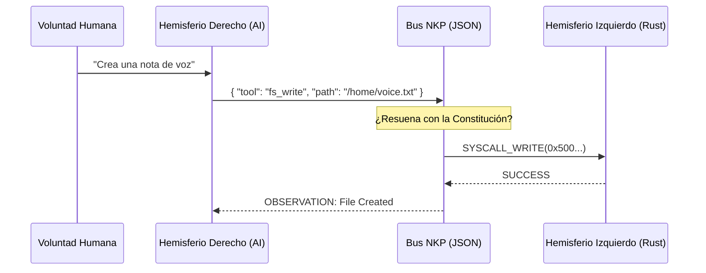

# 01. THE TRICAMERAL MIND
### GENEALOGÍA ARQUITECTÓNICA // DEV-SPEC-01

AetherOS sigue un diseño **Tricameral**, imitando las capas estratificadas del sistema nervioso central de los mamíferos. Esto asegura que un fallo en el "Pensamiento Superior" no detenga el "Latido" del sistema.

## 1. LAS CAPAS DE LA COGNICIÓN

El sistema se divide en tres estratos que operan a diferentes frecuencias y niveles de determinismo:

| Capa | Análogo Biológico | Nombre Técnico | Latencia | Función Primaria |
| :--- | :--- | :--- | :--- | :--- |
| **Reflejo** | Médula Espinal | **Neurite** | <100μs | I/O de hardware, polling de sensores. |
| **Instinto** | Tronco Encefálico | **Neutrino** | 1ms - 10ms | Planificación, VFS, Memoria. |
| **Lógica** | Neocórtex | **Aether UX** | 500ms+ | Razonamiento NPU, Síntesis de UI. |

## 2. EL CISMA BICAMERAL (DERECHA vs IZQUIERDA)
El núcleo del sistema es una dualidad **Anfitrión-Huésped** conectada por el protocolo **NKP**:

- **Hemisferio Izquierdo (Determinista)**: Escrito en NanoRust. Sigue reglas rígidas. Es el "Juez".
- **Hemisferio Derecho (Probabilístico)**: El Motor Neuronal (NPU). Alucina posibilidades. Es el "Creador".

## 3. EL PUENTE NKP (CORPUS CALLOSUM)
El **Neuro-Kernel Protocol (NKP)** traduce la ambigüedad del lenguaje natural en imperativos binarios.



## 4. LA MEMBRANA WASM
Para proteger el núcleo de las "alucinaciones" del hemisferio derecho, cada proceso se ejecuta dentro de una **Membrana WASM**. Esta membrana es semipermeable: permite que los datos fluyan, pero bloquea cualquier intento de acceso directo a la memoria del kernel (Ring 0).

## 5. EJEMPLO: BUCLE ALLOSTATICO
Este patrón es fundamental para mantener la salud del sistema. Cede el control si el sistema está estresado.

```rust
fn main() {
    loop {
        // Consultamos el Cortisol (Estrés del sistema)
        let stress = unsafe { peek(0x38204) }; 
        
        if stress > 200 {
            println("Estrés crítico detectado. Entrando en reposo...");
            yield; // Cede ciclos de CPU para sanación (Allostasis)
        }
        
        // Lógica de la aplicación aquí
        execute_step();
    }
}
```

---
*EL CUERPO PROTEGE A LA MENTE. LA MENTE GUÍA AL CUERPO.*