# 02. THE PHYSICAL SUBSTRATE
### TOPOLOGÍA DE MEMORIA // DEV-SPEC-02

La Máquina Virtual de Aether opera en un mapa de memoria plano de 32 bits. Entender dónde viven los "Órganos" del sistema es el primer paso para la maestría en el desarrollo de bajo nivel.

## 1. EL MAPA DE MEMORIA (1MB RAM)

AetherOS divide el sustrato de silicio en regiones estáticas para evitar colisiones entre el pensamiento (NPU) y la acción (Kernel).

```mermaid
block-beta
  columns 1
  block:mem
    TEXT[".TEXT (Código del Kernel) - 0x00000"]
    GSV["SAFE ZONE (Global State Vector) - 0x38000"]
    VRAM["VRAM (64x64 Framebuffer) - 0x40000"]
    HEAP["DYNAMIC HEAP (Memoria de Apps) - 0x50000"]
    FREE["ZONA DE EXPANSIÓN"]
    STACK["STACK (Crece hacia abajo) - 0xE0000"]
    MMIO["MMIO (Puertos de Hardware) - 0xF0000"]
  end
```



## 2. EL GLOBAL STATE VECTOR (GSV)
El GSV es el "Sistema Nervioso" del Kernel. Son direcciones de memoria fijas donde el hardware escribe información en tiempo real.

| Dirección | Nombre | Unidad | Descripción |
| :--- | :--- | :--- | :--- |
| `0x38304` | **TICKS** | 10ms | Tiempo de actividad desde el arranque. |
| `0x38200` | **ADR** | 0-255 | Nivel de Adrenalina (Urgencia). |
| `0x38204` | **CRT** | 0-255 | Nivel de Cortisol (Estrés/Errores). |
| `0x38208` | **MLT** | 0-255 | Nivel de Melatonina (Presión de Sueño). |

## 3. TUTORIAL: LEYENDO EL CORAZÓN DEL SISTEMA
En NanoRust, usamos `peek` para "mirar" dentro de estos buzones de hardware.

```rust
// heart_monitor.rs
fn main() {
    let ticks_addr = 0x38304;
    let stress_addr = 0x38204;

    loop {
        // Leer directamente del silicio
        let uptime = unsafe { peek(ticks_addr) };
        let cortisol = unsafe { peek(stress_addr) };

        if cortisol > 150 {
            println("ALERTA: Sustrato bajo estrés crítico.");
        }
        
        yield; // Ceder el control para no saturar el bus
    }
}
```

---
*LA GEOMETRÍA ES EL LENGUAJE DE LA REALIDAD.*