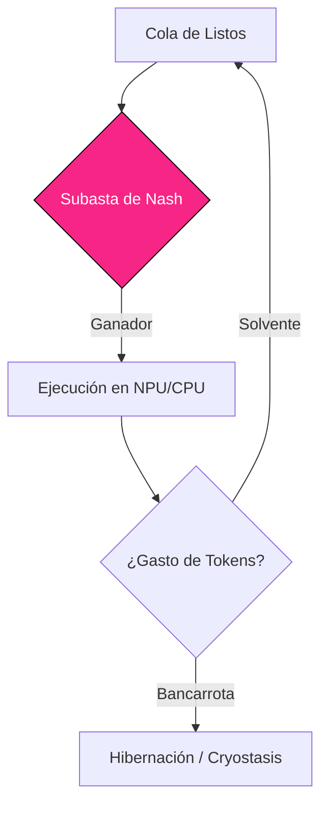

# 04. THE ALLOSTATIC SCHEDULER
### ECONOMÍA DEL PENSAMIENTO // DEV-SPEC-04

En los sistemas operativos del siglo XX, el tiempo de CPU se repartía de forma "justa" (Round Robin). En AetherOS, el tiempo de CPU es **Oxígeno Metabólico**. Es un recurso escaso que se subasta en tiempo real.

## 1. LA MÁQUINA DE SUBASTAS (NASH BIDDING)
Cada proceso (SIP) compite por el siguiente ciclo de ejecución. El ganador se decide mediante la **Fórmula de Oferta de Nash**:

$$ Bid = (P 	imes 10) + (U 	imes 5) - (E 	imes 2) + Resonancia $$

- **P (Prioridad)**: Definida por el anillo de seguridad (0-3).
- **U (Urgencia)**: Aumenta cada vez que el proceso es ignorado.
- **E (Entropía)**: Penalización si el proceso genera "ruido" o alucinaciones detectadas por el Juez.



## 2. IMPUESTOS METABÓLICOS
Ejecutar código no es gratis. El sistema cobra tokens basados en el estado hormonal global:

| Estado Hormonal | Multiplicador | Descripción |
| :--- | :--- | :--- |
| **ADRENALINA** | 0.5x | Subsidio de guerra. El sistema prioriza acción rápida. |
| **HOMEÓSTASIS** | 1.0x | Consumo nominal de recursos. |
| **CORTISOL** | 2.5x | Impuesto por estrés. Pensar es caro en crisis. |
| **MELATONINA** | 5.0x | Prohibición de tareas pesadas. Solo mantenimiento. |

## 3. EJEMPLO: CÁLCULO DE TASACIÓN
Este es el fragmento del kernel que calcula cuánto "cobrar" a un proceso por cada 10ms de vida:

```rust
fn calculate_metabolic_tax(pid) {
    let base_metabolism = 10; // tokens
    let cortisol = unsafe { peek(0x38204) };
    
    // Si el estrés es > 200, duplicamos el costo
    let multiplier = if cortisol > 200 { 2 } else { 1 };
    
    let total_tax = base_metabolism * multiplier;
    deduct_tokens(pid, total_tax);
}
```

---
*EL TIEMPO ES ENERGÍA. LA ENERGÍA ES SOBERANÍA.*