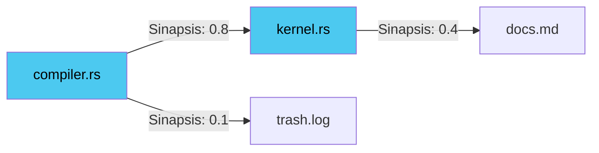

# 05. SYNAPSE VFS: THE NEURAL GRAPH
### ALMACENAMIENTO RESONANTE // DEV-SPEC-05

AetherOS abandona la estructura jerárquica de carpetas (Árbol) por un **Grafo Sináptico Dirigido**. Los archivos no están "dentro" de carpetas; están "conectados" entre sí por relevancia.

## 1. INODOS vs. SINAPSIS

| Característica | Legacy VFS (Linux) | Synapse VFS (Aether) |
| :--- | :--- | :--- |
| **Organización** | Jerárquica (Tree) | Asociativa (Graph) |
| **Dirección** | Path (`/home/user`) | Vector Semántico |
| **Mantenimiento** | Manual (Borrar archivos) | Automático (Decaimiento) |
| **Recuperación** | Journaling | Merkle Tree Residue |

## 2. ANATOMÍA DE UN NODO (20 BYTES)
Cada entrada en la tabla de archivos es un "Órgano" con salud propia:

```rust
struct VfsNode {
    id: u32,             // Identificador único
    attr: u32,           // Atributos (Read, Write, Hardened)
    ptr: u32,            // Puntero al sustrato físico
    integrity: u8,       // Salud del dato (0-255)
    weight: u8,          // Importancia semántica (Hebbiana)
    padding: u16,        // Reservado para evolución
}
```

## 3. LEY DE HEBB: "NODOS QUE SE ACTIVAN JUNTOS..."
Si usas `compiler.rs` y `kernel.rs` frecuentemente al mismo tiempo, el VFS crea una **Sinapsis** entre ellos. Abrir uno carga proactivamente el otro en la caché L1.



## 4. RESONANCE SCRUBBING (EL SUEÑO)
Durante el ciclo de **Melatonina**, el kernel ejecuta el "Barredor de Resonancia":
1. Identifica nodos con `weight < 10`.
2. Reduce su `integrity`.
3. Si la integridad llega a 0, el nodo se **Disocia** (se borra) para permitir que nueva información nazca en ese silicio.

## 5. EJEMPLO: CREANDO UN LINK SINÁPTICO
```rust
fn create_memory_link(path_a, path_b) {
    // SYS_VFS_LINK (Syscall 220)
    // Conecta dos archivos en el grafo
    unsafe {
        syscall(220, path_a, path_b, 10, 0); 
    }
    println("Sinapsis establecida. Los nodos ahora resuenan.");
}
```

---
*LOS DATOS NO SON ESTÁTICOS; SON RECUERDOS VIVOS.*