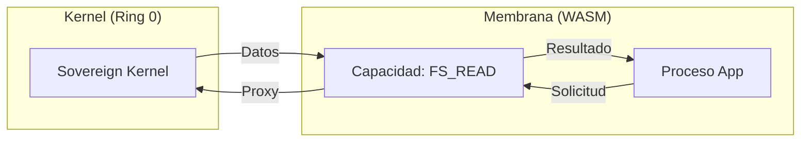

# 06. THE MEMBRANE: WASM ISOLATION
### SEGURIDAD BASADA EN LENGUAJE // DEV-SPEC-06

En AetherOS, la seguridad no es un muro externo; es una propiedad de la materia. Abandonamos el aislamiento basado en hardware (MMU/Paging) por el **Aislamiento Basado en Lenguaje (LBI)** mediante la **Membrana WASM**.

## 1. SIPs: SOFTWARE ISOLATED PROCESSES
Un proceso en AetherOS es un **SIP**. A diferencia de un proceso de Linux, todos los SIPs comparten el mismo espacio de direcciones físicas. La "Membrana" (el runtime de WASM) garantiza que un proceso no pueda leer ni escribir fuera de sus límites.

| Característica | Proceso Unix (Legacy) | SIP Aether (Soberano) |
| :--- | :--- | :--- |
| **Aislamiento** | Hardware (MMU/Tablas de Pág) | Software (Validación de Tipos) |
| **Context Switch** | Pesado (~5000 ciclos) | Instantáneo (~10 ciclos) |
| **Comunicación** | Copia de Memoria (Pipe/Socket) | Movimiento de Punteros (Zero-Copy) |
| **Confianza** | Binario Opaco | Código Verificable |

## 2. EL MODELO DE CAPACIDADES (OCAP)
Un SIP nace con **Poder Zero**. No puede ver el reloj, ni los archivos, ni la red. El Kernel le otorga "Tokens de Capacidad".



## 3. EJEMPLO: LLAMADA A SISTEMA PROTEGIDA
Este código de NanoRust, al compilarse a WASM, es interceptado por la membrana.

```rust
fn main() {
    // El SIP intenta abrir un archivo
    // La membrana verifica si el proceso "posee" el token para este path
    let fd = open("/etc/constitution.txt");
    
    if fd < 0 {
        println("Acceso Denegado por la Membrana.");
    } else {
        // Ejecución autorizada
        read_and_display(fd);
    }
}
```

---
*LA SEGURIDAD NO ES UN MURO, ES UNA LEY FÍSICA DEL SUBSTRATO.*