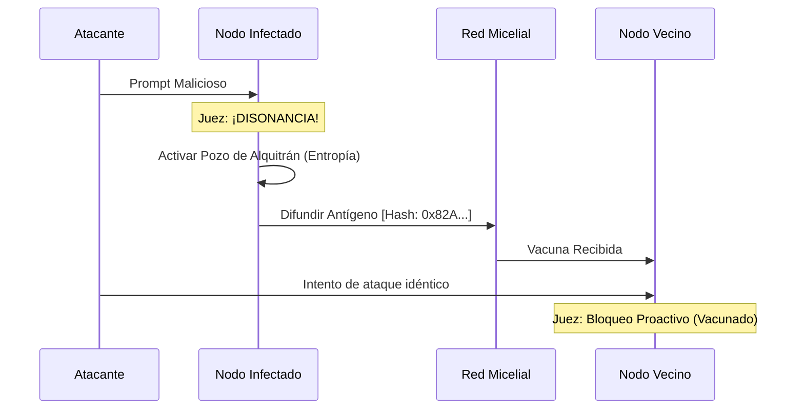

# 07. DIGITAL IMMUNITY & DEFENSE
### RESILIENCIA POR ENTROPÍA // DEV-SPEC-07

AetherOS no bloquea los ataques; los **digiere**. Utilizamos un modelo inmunológico donde las acciones disonantes generan **Antígenos** que vacunan al resto de la red.

## 1. EL JUEZ CONSTITUCIONAL
Cada Syscall enviada por el Hemisferio Derecho (AI) pasa por el Juez. El Juez no mira "quién" eres, sino "qué" quieres hacer (Vector de Intención).

$$ Resonancia = cos(	heta_{intención, constitución}) $$

- **Resonancia > 0.9**: Ejecución inmediata.
- **Resonancia < 0.5**: Disonancia detectada. Activación de respuesta inmune.

## 2. EL POZO DE ALQUITRÁN (THE TAR PIT)
Cuando un proceso es identificado como malicioso o alucinatorio, el Kernel no lo mata inmediatamente (esto daría información al atacante). En su lugar, le inyecta **Entropía**.

| Respuesta Inmune | Efecto Técnico | Objetivo |
| :--- | :--- | :--- |
| **Jitter de CPU** | Se saltan ciclos de ejecución aleatoriamente. | Romper ataques de tiempo (Timing Attacks). |
| **Memory Blur** | Las lecturas de RAM devuelven ruido estático. | Evitar exfiltración de datos. |
| **Latency Bloat** | Cada syscall tarda un tiempo exponencial. | Agotar los recursos del atacante (Tarpitting). |

## 3. PROPAGACIÓN DE ANTÍGENOS
Si un nodo detecta un patrón de ataque (ej. un prompt de inyección), genera un **Hash de Antígeno** y lo envía por el **Mycelial Link**.



## 4. EJEMPLO: REPORTE DE PATÓGENO
```rust
fn handle_security_fault(pid, intent) {
    let signature = hash_semantic_intent(intent);
    
    // Generar Antígeno
    let antigen = Antigen {
        id: crypto.uuid(),
        sig: signature,
        virulence: 0.95
    };
    
    // Inyectar en el Sistema Inmune Global
    unsafe { syscall(SYS_IMMUNE_VACCINATE, antigen); }
    
    println("Patógeno detectado. Vacunando a la colmena...");
}
```

---
*LA RED ES EL CUERPO. LA SOBERANÍA ES LA SALUD.*