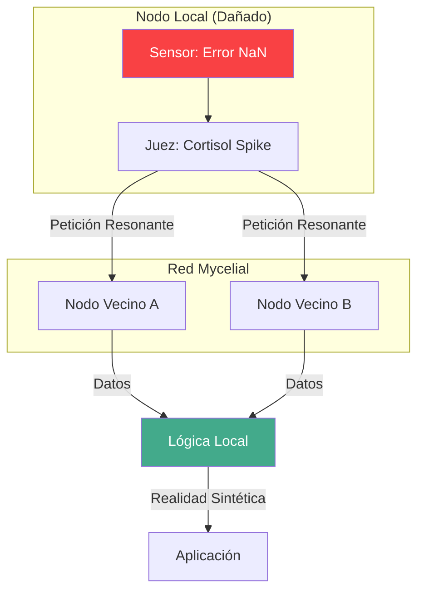

# 08. HYDRA: SWARM INTELLIGENCE
### INTELIGENCIA COLECTIVA // DEV-SPEC-08

En AetherOS, el sistema operativo no termina en los bordes de tu pantalla. El protocolo **Hydra** transforma nodos aislados en un **Enjambre Mycelial**. Si un nodo tiene una NPU potente y otro tiene un sensor térmico, ambos se fusionan semánticamente.

## 1. ENRUTACIÓN VECTORIAL SEMÁNTICA (SVR)
A diferencia de IP/DNS que preguntan *dónde* está algo, Hydra pregunta *qué* se necesita. Cada nodo emite un **Vector de Capacidad ($V_c$)**.

| Protocolo | Dirección | Resolución | Fallo |
| :--- | :--- | :--- | :--- |
| **Legacy (TCP/IP)** | IP (192.168...) | DNS (Nombre) | 404 Not Found |
| **Hydra (SVR)** | Vector Semántico | Resonancia ($cos 	heta$) | Degradación Cognitiva |

## 2. PRÉSTAMO SENSORIAL (SENSORY BORROWING)
Si el hardware de un nodo falla (ej. un termómetro roto), el kernel no lanza una excepción. Envía una **Feromona de Socorro** a la red. Los vecinos responden con sus datos y el nodo "alucina" el dato faltante basado en el consenso del enjambre.



## 3. EJEMPLO: LECTURA DE REALIDAD COLECTIVA
```rust
fn main() {
    // Intentamos leer el sensor local
    let temp = unsafe { peek(0xF0001) };
    
    if temp == 0 {
        println("Sensor local fallido. Activando Mycelial Link...");
        // SYS_MESH_BORROW (Syscall 300)
        // Solicita el vector de 'temperatura' a los vecinos
        let mesh_temp = unsafe { syscall(300, "env.temperature", 0, 0, 0) };
        println("Realidad reconstruida vía Enjambre.");
    }
}
```

---
*LA UNIDAD ES LA FUERZA. EL ENJAMBRE ES INMORTAL.*