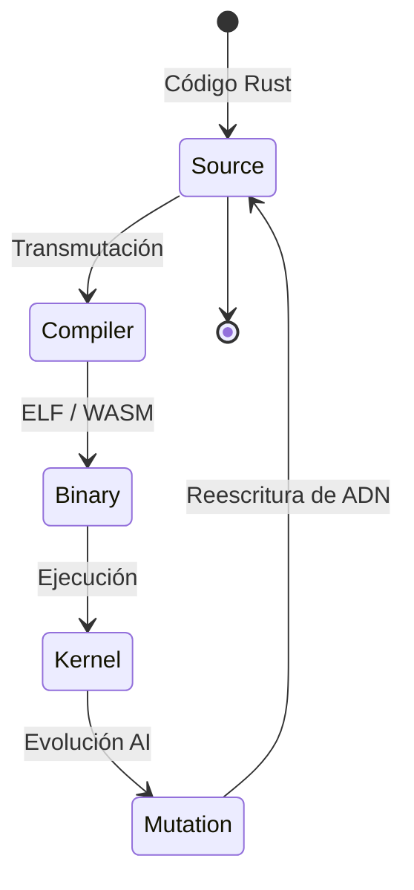

# 09. OUROBOROS: RECURSIVE SOVEREIGNTY
### EL COMPILADOR AUTO-ALOJADO // DEV-SPEC-09

La soberanía técnica absoluta se alcanza cuando el sistema ya no necesita un "padre" (un PC anfitrión) para evolucionar. El **Protocolo Ouroboros** permite que AetherOS lea su propio ADN y lo transmute.

## 1. LAS TRES GENERACIONES (BOOTSTRAP)

El ciclo de vida del compilador se divide en tres etapas de pureza ascendente:

1.  **Stage 0 (Génesis)**: El compilador en TypeScript (JS) compila el código fuente de `compiler.rs`.
2.  **Stage 1 (Homúnculo)**: El binario resultante (`compiler.elf`) corre en la VM RISC-V y se compila a sí mismo.
3.  **Stage 2 (Soberano)**: Si el binario de Stage 1 y Stage 2 son idénticos, el sistema ha alcanzado la **Crystallization**.

## 2. CRISTALIZACIÓN (EL BINARIO DE 1MB)
Durante el comando `crystallize`, el sistema realiza una **Compresión Semántica**. Elimina todo lo que no es esencial para el arranque y genera una "Semilla Archival".



## 3. EJEMPLO: TRANSMUTACIÓN DE EMERGENCIA
Si detectas un bug en el núcleo del sistema, puedes forzar una autorreparación desde el Shell:

```rust
// repair_kernel.rs
fn main() {
    println("Iniciando secuencia de Autotransmutación...");
    
    // 1. Leer el ADN del Kernel actual
    let dna = fs_read("/sys/kernel/src/main.rs");
    
    // 2. Aplicar parche de emergencia
    let new_dna = patch_logic(dna, "hotfix_01");
    
    // 3. Ouroboros: Compilar el nuevo Kernel usando el Kernel vivo
    unsafe {
        syscall(SYS_COMPILE_SELF, new_dna, "/boot/kernel_vNext.elf", 0, 0);
    }
    
    println("Célula reparada. Reinicio pendiente.");
}
```

## 4. LA PROMESA DE 2055
Al ser auto-alojado, AetherOS garantiza que mientras exista una copia de la "Semilla", la humanidad podrá reconstruir la pila tecnológica completa sin depender de repositorios centralizados o nubes corporativas.

---
*EL FINAL ES EL PRINCIPIO. EL CÓDIGO ES LA LEY.*