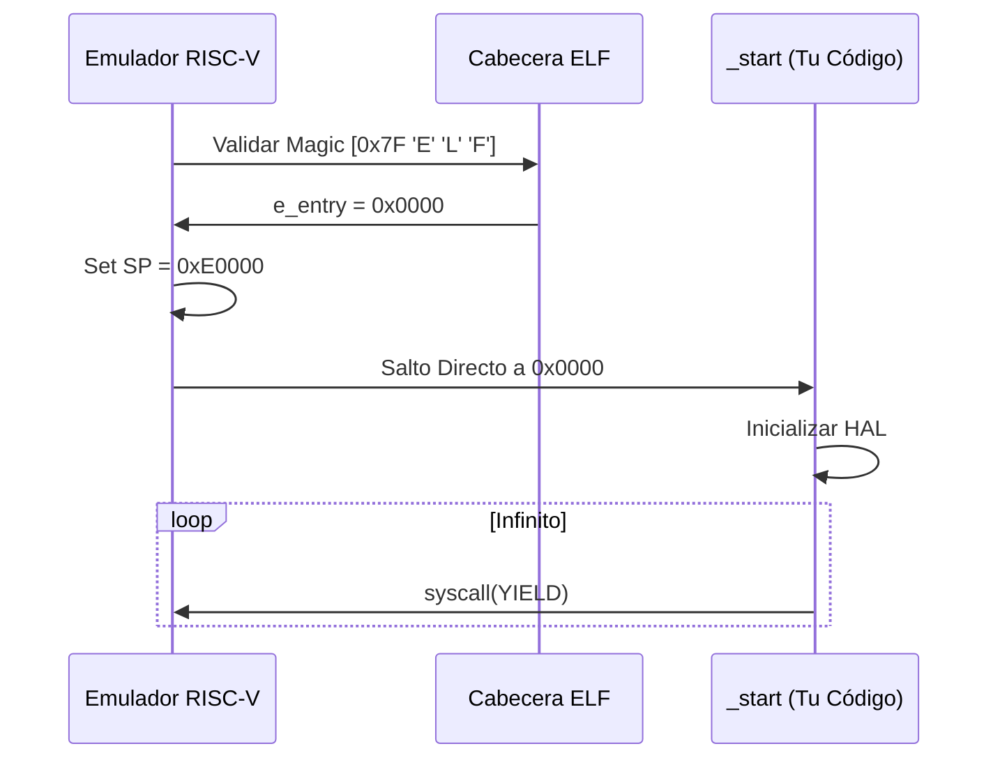

# 12. THE GENESIS BYTE: ENTRY PROTOCOLS
### INGENIERÍA DEL PUNTO DE ENTRADA // DEV-SPEC-12

En un sistema operativo convencional, el cargador prepara todo. En AetherOS, tú eres el cargador. El símbolo `_start` no es solo una función; es el primer contacto entre la lógica pura y el silicio virtual.

## 1. LA ANATOMÍA DE `_start`
A diferencia de `main()`, `_start` no puede devolver el control a nadie. Por eso su tipo de retorno es `!`, el tipo "Never" en Rust.

```rust
#[no_mangle]
pub extern "C" fn _start() -> ! {
    // 1. Inicializar Hardware Crítico
    hal_init();
    
    // 2. Saltar al bucle allostático
    loop {
        kernel_main_tick();
        yield; // El latido del sistema
    }
}
```

## 2. EL ABI DE ARRANQUE (BOOT ABI)
Cuando el emulador RISC-V salta a tu código, los registros están en un estado predefinido:

| Registro | Valor Inicial | Rol |
| :--- | :--- | :--- |
| `x2` (sp) | `0xE0000` | Puntero de Pila. Crece hacia abajo. |
| `x10` (a0) | `0x00` | ID del procesador (Hart ID). |
| `pc` | `0x00000` | Dirección de la primera instrucción. |

## 3. SECUENCIA DE IGNICIÓN


## 4. EL CONTRATO DE COOPERACIÓN
Debido a que el emulador corre en el hilo del navegador, un bucle infinito sin `yield` congelará la interfaz. La instrucción `yield` en NanoRust emite un `ECALL` con `a7=120`, lo que permite al navegador respirar y procesar eventos de usuario.

---
*REVISIÓN 10.5 // TODO COMIENZA CON UN SOLO BYTE.*