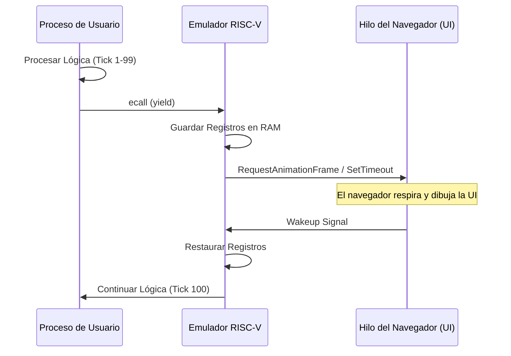

# 14. THE YIELD CONTRACT: COOPERATIVE MULTITASKING
### GESTIÓN DE CICLOS VIRTUALES // DEV-SPEC-14

En AetherOS, los procesos no son interrumpidos por el hardware. Son **Software Isolated Processes (SIPs)** que deben ceder el control voluntariamente. Si un programa "se olvida" de ser amable, el navegador entrará en un *Execution Strangle*, congelando la interfaz.

## 1. EL HANDSHAKE DE YIELD
Cuando invocas `yield`, el emulador captura una instrucción `ECALL` con `a7=120`. Esto suspende la CPU virtual, guarda el contexto en el PCB y permite que el motor de JavaScript del navegador procese eventos de UI.



## 2. LÓGICA DE MUTABILIDAD
En NanoRust, la mutabilidad es una declaración de **Uso de Registro**. 

- `let x = 5;`: El compilador puede optimizar `x` como un valor inmediato en la instrucción o un registro de solo lectura.
- `let mut x = 5;`: Obliga al compilador a asignar un registro persistente o un espacio en la pila que pueda ser modificado por instrucciones `ADD` o `SW`.

## 3. REGLA DE ORO: EL LÍMITE DE LOS 100 TICKS
Para una fluidez de 60 FPS, un proceso no debería ejecutar más de 10,000 instrucciones sin un `yield`. El patrón recomendado es:

```rust
fn process_large_data(ptr, size) {
    let mut i = 0;
    while i < size {
        do_heavy_work(ptr + i);
        i = i + 1;
        // Estrategia de Allostasis: ceder cada 100 iteraciones
        if (i % 100) == 0 { yield; }
    }
}
```

---
*REVISIÓN 10.5 // LA CORTESÍA ES LA BASE DE LA CONCURRENCIA.*